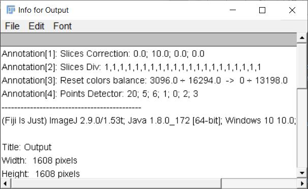
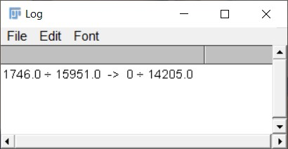
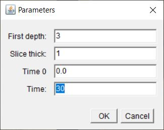
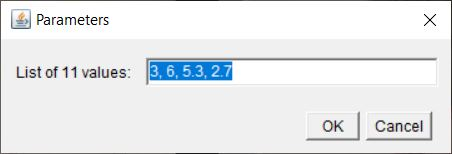
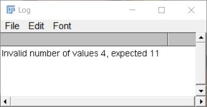
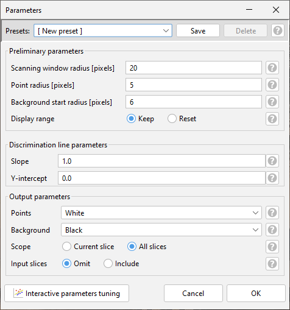

# Background Remover Help - PL

## Instalacja i informacje wstępne

Aby móc używać zestawu narzędzi do przetwarzania obrazów z mikroskopu w celu wyszukania śladów po promieniowaniu należy pobrać plik BackgroundRemover.jar i umieścić go w katalogu Plugins (podkatalog katalogu ImageJ lub Figi.app). Po ponownym uruchomieniu programu powinien być on widoczny w menu rozwijanym w ImageJ: **Plugins -> FNTD IFJ**.

W skład pakietu **FNTD IFJ** wchodzą następujące narzędzia:
1. _Background Remover_ - główna część paczki, która służy do analizy obrazu i odseparowania sygnału of szumu.
2. _Slices Correction_ - plugin służący wprowadzaniu do stosu obrazów poprawek na wypalanie i głębokość.
3. _Slice Multiply_ - plugin pozwalający na wprowadzenie dodatkowych poprawek do stosu obrazów.
4. _Reset color balance_ - plugin przesuwający zakres wyświetlania (display range) tak, aby 0 odpowiadało kolorowi czarnemu.
5. _Stack to CSV_ - plugin umożliwiający przekonwertowanie stosu obrazów na odpowiadający im zestaw plików CSV.
6. _Points generator_ - wtyczka generująca losowe punkty na obrazie - według parametrów zadanych przez użytkownika.

W pierwszej kolejności należy wczytać plik w postaci pojedynczego obrazka albo stacku. Plugin uruchamia się domyślnie dla aktywnego okna. 

Plugin umieszcza adnotacje odnośnie wykonanych na pliku operacji. Można je prześledzić wchodząc w **Image -> Show Info...**.

## Reset color balance

Dla wybranego obrazka (lub stosu) zakres wyświetlania (Display range) zostaje przesunięty tak, aby 0 odpowiadało kolorowi czarnemu. Po wykonaniu wyświetlone zostaje okno z informacją z o przesunięciu.

## Slices Correction

Część pluginu umożliwiająca wprowadzenie poprawek na wypalanie oraz głębokość. 

Współczynnik korekcyjny na wypalanie dla konkretnego obrazu w stosie obliczany jest według wyznaczonego empirycznie wzoru:

$$
  time\\\_corr = 0.765*e^{(\frac{-t}{443.85})}+0.235
$$

$$
  t = t_{0}+ (n-1)*step
$$

gdzie: 
$t_{0}$ - czas początkowy [s]; 
$n$ - numer obrazu; 
$step$ - czas odczytu pojedynczego obrazu [s].

Poszczególne wartości pikseli na obrazie są następnie dzielone przez obliczony według powyższego wzoru współczynnik korekcyjny.

Analogicznie wprowadzane są poprawki na głębokość. Tutaj także posługujemy się wzorem wyznaczonym empirycznie:

$$
depth\\\_corr = e^{-0.015 * d}
$$

$$
  d = d_{0}+ (n-1)*step
$$

gdzie: 
$d_{0}$ - głębokość startowa [&mu;m]; 
$n$ - numer obrazu; 
$step$ - krok o jaki zwiększana jest głębokość na jakich dokonywany jest odczyt [&mu;m].

Podobnie jak wcześniej - wartości poszczególnych pikseli na obrazie dzielone są przez wartość współczynnika korekcyjnego na głębokość wyznaczonego dla danego obrazu.

Jako wartości wejściowe należy podać: 
**First depth** - głębokość na jakiej dokonywany jest odczyt (0 oznacza powierzchnię) [&mu;m]; 
**Slice thick** - krok o jaki zwiększa się głębokość [&mu;m]; 
**Time 0** - czas początkowy (w przypadku, gdy dany kryształ był już uprzednio odczytywany) [s]; 
**Time** - czas odczytu każdego z obrazów [s].

Program wprowadzi obie poprawki jednocześnie na oryginalnym obrazie.

## Slice dev

Część pluginu umożliwiajaca podzielenie wartości pikseli na poszczególnych obrazach przez podane przez użytkownika wartości. W polu tekstowym należy podać kolejno odpowiednie dzielniki dla poszczególnych obrazów oddzialając je przecinkiem. W przypadku, gdy dany obraz w stosie ma pozostać bez zmian należy jako odpowiadający mu dzielnik podać wartość 1. Liczba podanych wartości musi się zgadzać z liczbą obrazów w stosie, w przeciwnym razie program wyrzuci informację o niezgodności (poda liczbę współczynników wprowadzonych przez użytkownika oraz liczbę oczekiwanych współczynników.

## Background Remover

Program może działać w dwóch trybach: automatycznym i manualnym. W trybie automatycznym podajemy w polu Parameters ustalone wcześniej parametry. Dodatkowo można spersonalizować sposób wyświetlania wyniku: wyznaczonych punktów i sygnału uznanego za tło. Po kliknięciu OK program automatycznie wyszukuje punkty i otwiera nowe okno z obrazem wynikowym. 

Dostępne opcje wyświetlenia punktów:
- **White** - punkty wyświetlane na biało;
- **Black**- punkty wyświetlane na czarno;
- **Orginal** - punkty wyświetlane takie same jak na obrazie oryginalnym;
- **Degree of matching** - jasność pikseli odpowiada różnicy między wyliczoną przez program "jasnością punktu", a "jasnością tła" (im jaśniejszy punkt, tym bardziej "wystaje on ponad tło");
- **Net signal (average)** - wartość pikseli odpowiada podstawowej wartości pikseli pomniejszonej o tło wyliczone jako średnia arytmetyczna pikseli wokół danego punktu;
- **Net signal scaled (average)** - wartość pikseli odpowiada podstawowej wartości pikseli pomniejszonej o tło wyliczone jako średnia arytmetyczna pikseli wokół danego punktu, wynik przeskalowany dla lepszej widoczności do całej szerokości zakresu wyświetlania;
- **Net signal (mode)** - wartość pikseli odpowiada podstawowej wartości pikseli pomniejszonej o tło wyliczone jako wartość modalna pikseli wokół danego punktu;
- **Net signal scaled (mode)** - wartość pikseli odpowiada podstawowej wartości pikseli pomniejszonej o tło wyliczone jako wartość modalna pikseli wokół danego punktu, wynik przeskalowany dla lepszej widoczności do całej szerokości zakresu wyświetlania;
- **Net signal (median)** - wartość pikseli odpowiada podstawowej wartości pikseli pomniejszonej o tło wyliczone jako mediana pikseli wokół danego punktu;
- **Net signal scaled (median)** - wartość pikseli odpowiada podstawowej wartości pikseli pomniejszonej o tło wyliczone jako mediana pikseli wokół danego punktu, wynik przeskalowany dla lepszej widoczności do całej szerokości zakresu wyświetlania;

Dostępne opcje wyświetlenia tła:
- **White** - tło wyświetlane na biało;
- **Black** - tło wyświetlane na czarno;
- **Orginal** - tło wyświetlane takie same jak na obrazie oryginalnym;
- **Degree of matching** - jasność pikseli odpowiada różnicy między wyliczoną przez program "jasnością punktu", a "jasnością tła";

Dodatkowo można zaznaczyć opcje:
- **All slices** - plugin wykonuje operacje nie tylko na wybranym obrazie, ale na wszystkich obrazach w stosie w aktywnym oknie;
- **Keep orginal slices** - jako wynik plugin tworzy stos obrazów, gdzie wynikowe obrazy przeplatane są odpowiadającymi im oryginalnymi obrazami (funkcja przydatna przy porównywaniu obrazów wynikowych i oryginalnych);
- **Manual mode** - przejście do trybu manualnego.

## Tryb manualny

W trybie manualnym parametry możemy ustalać na bieżąco. Po wybraniu opcji Manual mode i kliknięciu OK przechodzimy do trybu manualnego ustalania parametrów. Otwiera się seria okien. W pierwszej kolejności w Menu ustalamy wielkość okna skanującego (Scaning window size). 

TIP: Im gęściej rozmieszczone punkty tym rozmiar okna powinien być mniejszy.

Następnie podajemy przewidywany rozmiar punktów.

TIP: Można przybliżyć obraz, aby orientacyjnie ocenić wielkość punktów.

Krok kolejny to zaznaczenie w oknie Noise obszarów, które zawierają wyłącznie szum/tło. W tym celu można użyć dowolnego narządzia wyboru z ImageJ. Aby dodać kolejne obszary należy trzymać wciśnięty przycisk SHIFT. 

TIP: Ważne jest aby zaznaczyć obszary tła o jak najbardziej zróżnicowanej jasności.

Wybrane obszary zostają zaznaczone na wykresie w oknie Plot. Na poniższym wykresie poszczególne grupy punktów odpowiadają obszarom oznaczonym na zdjęciu. Warto zwrócić uwagę na różne poziomy jasności zaznaczonych obszarów

W kolejnym etapie w oknie Points za pomoca narzędzia wyboru punktów z ImageJ zaznaczamy punkty. Oznaczone punkty pojawiają się na wykresie w oknie Plot.

Aby zaznaczać kolejne punkty należy trzymać wciśnięty przycisk SHIFT. 

TIP: Ważne jest oznaczenie szczególnie tych punktów, które w najmniejszym stopniu odróżniają się od otaczającego je tła. W tym celu warto powiększyć sobie wybrane obszary obrazu.

Po zaznaczeniu obszarów szumu i punktów możemy dopasować ręcznie prostą odcinającą szum od punktów. (Można albo po prostu przesunąć istniejącą już na wykresie prostą, albo narysować właśną za pomocą narzędzia rysowania prostej z ImageJ.) Parametry prostej pokazują się na bieżąco w oknie Menu, natomiast obraz wynikowy można podejrzeć w oknie Preview. Przesuwając pasek na dole okna można podejrzeć porównanie obrazu wejściowego i wynikowego.

