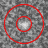
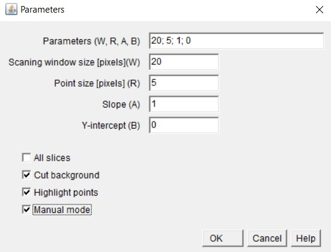
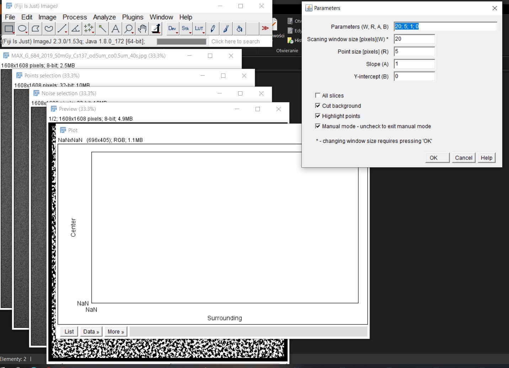
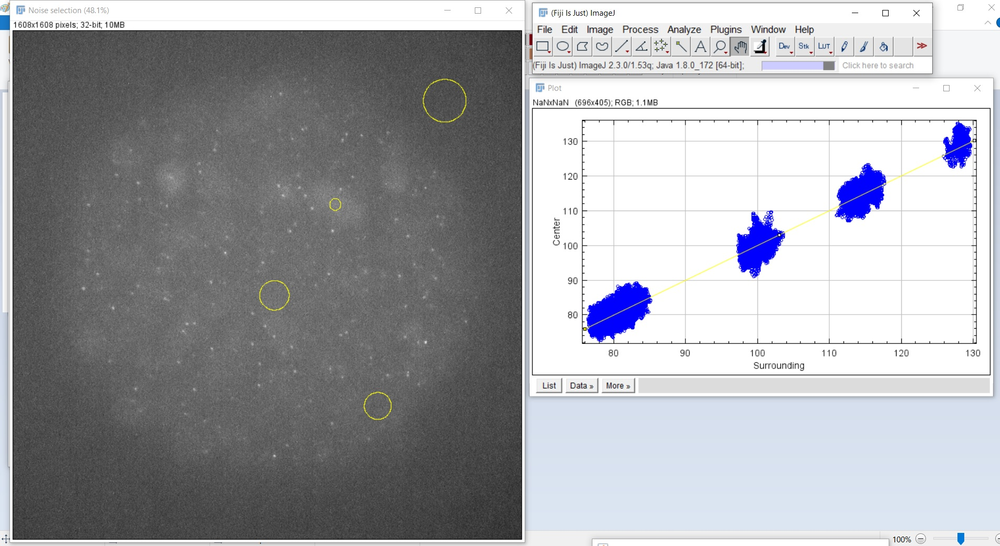
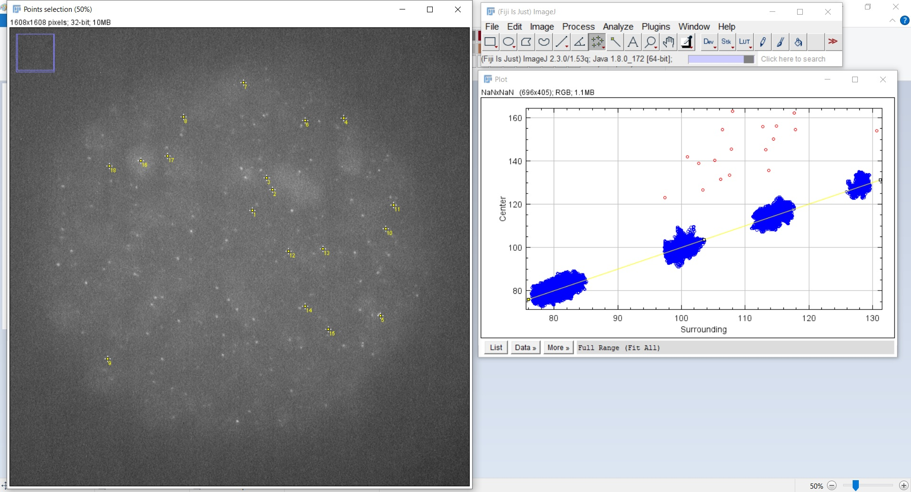
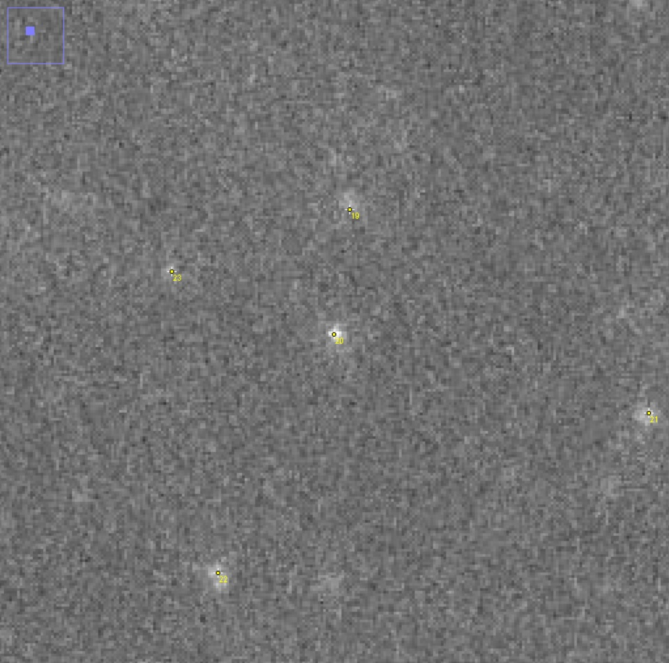
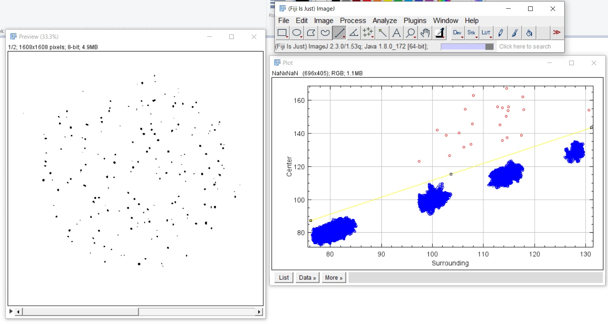

# Points Detector Help - PL

## Instalacja

Aby móc używać pluginu Points detector należy pobrać plik Points_Detector.jar i umieścić go w katalogu Plugins. Po ponownym uruchomieniu programu powinien być on widoczny w menu rozwijanym w Imagej -> Plugins.

## Uruchomienie pluginu

W pierwszej kolejności należy wczytać plik w postaci pojedynczego obrazka albo stacku. Plugin uruchamia się domyślnie dla aktywnego okna.

Program może działać w dwóch trybach: automatycznym i manualnym. W trybie automatycznym podajemy w polu Parameters ustalone wcześniej parametry. Po kliknięciu OK program automatycznie wyszukuje punkty i otwiera nowe okno z obrazem wynikowym. W trybie manualnym parametry należy ustalić na bieżąco.

## Tryb manualny

Po wybraniu opcji Manual mode i kliknięciu OK przechodzimy do trybu manualnego ustalania parametrów. Otwiera się seria okien. W pierwszej kolejności w Menu ustalamy wielkość okna skanującego (Scaning window size). 

TIP: Im gęściej rozmieszczone punkty tym rozmiar okna powinien być mniejszy.

Następnie podajemy przewidywany rozmiar punktów.

TIP: Można przybliżyć obraz, aby orientacyjnie ocenić wielkość punktów.

Krok kolejny to zaznaczenie w oknie Noise obszarów, które zawierają wyłącznie szum/tło. W tym celu można użyć dowolnego narządzia wyboru z ImageJ. Aby dodać kolejne obszary należy trzymać wciśnięty przycisk SHIFT. 

TIP: Ważne jest aby zaznaczyć obszary tła o jak najbardziej zróżnicowanej jasności.

Wybrane obszary zostają zaznaczone na wykresie w oknie Plot. Na poniższym wykresie poszczególne grupy punktów odpowiadają obszarom oznaczonym na zdjęciu. Warto zwrócić uwagę na różne poziomy jasności zaznaczonych obszarów

W kolejnym etapie w oknie Points za pomoca narzędzia wyboru punktów z ImageJ zaznaczamy punkty. Oznaczone punkty pojawiają się na wykresie w oknie Plot.

Aby zaznaczać kolejne punkty należy trzymać wciśnięty przycisk SHIFT. 

TIP: Ważne jest oznaczenie szczególnie tych punktów, które w najmniejszym stopniu odróżniają się od otaczającego je tła. W tym celu warto powiększyć sobie wybrane obszary obrazu.

Po zaznaczeniu obszarów szumu i punktów możemy dopasować ręcznie prostą odcinającą szum od punktów. (Można albo po prostu przesunąć istniejącą już na wykresie prostą, albo narysować właśną za pomocą narzędzia rysowania prostej z ImageJ.) Parametry prostej pokazują się na bieżąco w oknie Menu, natomiast obraz wynikowy można podejrzeć w oknie Preview.

## Opcje

