# Background Remover Help

## Installation and introductory information

In order to use the microscope image processing toolkit for separating signal from noise, you will need to download the BackgroundRemover.jar file and place it in the Plugins directory, which is a subdirectory of either the ImageJ or Figi.app directory. After restarting the program, the toolkit will be readily accessible in the drop-down menu under ImageJ: **Plugins -> Background Remover**.

The file should be imported as a single image or a stack. The image (or stack) must be in a 16-bit grayscale. By default, the plugin is run for the active window.

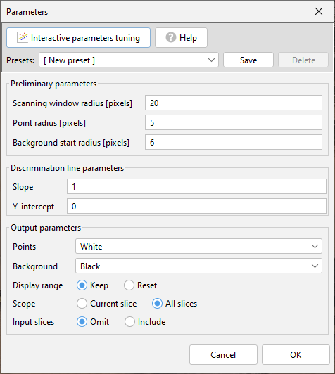 
Main window

The program has two modes: automatic and manual. In automatic mode, we can enter predetermined parameters in individual fields or load a previously saved set of parameters (Preset). After clicking OK, the program automatically searches for points and opens a new window with the resulting image. We switch to manual mode using the "**Interactive parameters tuning**" button located in the upper left part of the window.

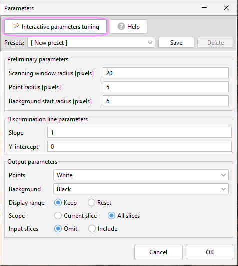 
Interactive parameters tuning button

The plugin places annotations regarding the operations performed on the file. They can be viewed by going to **Image -> Show Info...**.

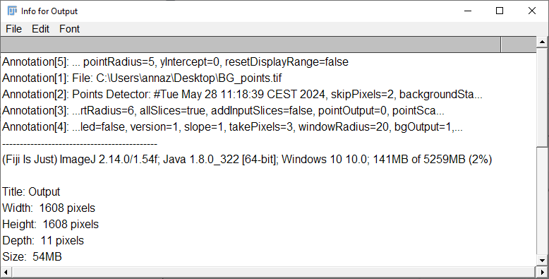 
Example of annotations

Please note that due to the specific nature of ImageJ, annotations are displayed in random order. They should be read in the order consistent with the numbering given in square brackets.

## Automatic mode

The automatic mode is easy to use and performs transformations based on user-provided parameters. These parameters can be entered manually or loaded from a file.

### Presets

The new preset can be created by selecting the **[ New ]** option from the **Presets** drop-down list. After all the fields with the set parameters have been completed, the **Save** button should be clicked. A new window will open, asking for the name of the preset being saved. Once a name is selected and confirmed, the created preset will appear in the preset drop-down list at the top of the window.

To access a previously created preset, it can be selected from the **Presets** drop-down list. The existing preset can be updated while maintaining the changes made using the **Save** button. By selecting **[Recently used]** from the drop-down list, the most recently used preset will be loaded. The preset can be deleted using the **Delete** button.

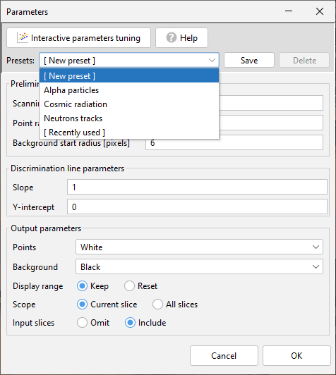 
Presets list

### Preliminary parameters

Preliminary parameters determine the size of the scanning window and the approximate size of objects in the image.

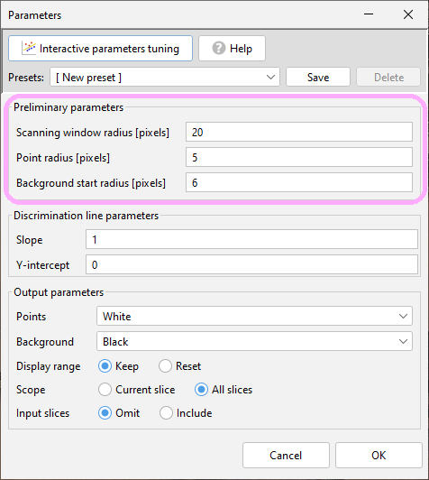 
Preliminary parameters section

These parameters include:
- **Scanning window radius** - the size of the scanning window in pixels (half the length of the side of the square);
- **Point radius** - point size in pixels (radius);
- **Background start radius** - distance from the analyzed point, above which pixels located are treated as background (this distance should be greater than **Point radius**).

### Discrimination line parameters

To separate the signal from the noise, the program uses an appropriately adjusted discrimination line with the equation:

$$
  y = a*x+b
$$

- **Slope** - slope coefficient of simple discrimination (a);
- **Y-Intercept** - the point of intersection of the discrimination line with the OY axis (b).

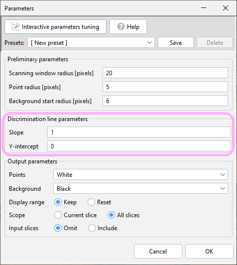 
Discrimination line parameters section

If these parameters are not known, they should be established in manual mode.

### Output parameters

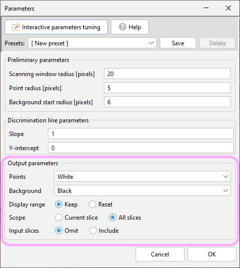 
Output parameters section

**Points** - point display options available in the drop-down list:
  - **White** - points displayed in white;
  - **Black** - points displayed in black;
  - **Orginal** - points displayed the same as in the original image;
  - **Degree of matching** - pixel brightness corresponds to the difference between the "point brightness" calculated by the program and the "background brightness" (the brighter the point, the more it "sticks out above the background");
  - **Net signal (average)** - the pixel value corresponds to the basic pixel value minus the background calculated as the arithmetic mean of pixels around a given point;
  - **Net signal (mode)** - the pixel value corresponds to the basic pixel value minus the background calculated as the modal value of pixels around a given point;
  - **Net signal (median)** - the pixel value corresponds to the basic pixel value minus the background calculated as the median of pixels around a given point.

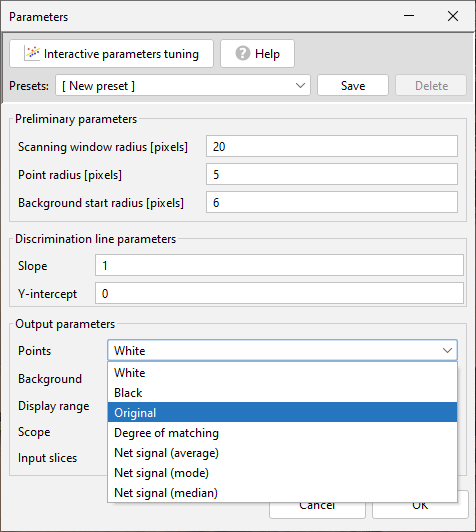 
Signal points types list

If one of the **Net signal** options is selected, two additional fields will appear with parameters to set:
- **Skip pixels** - the difference between the radius of the point for which the background is calculated and the inner radius of the ring based on which the background value is calculated.
- **Take pixels** - the difference between the outer and inner radius of the ring used to calculate the background.

 
Net signal parameters

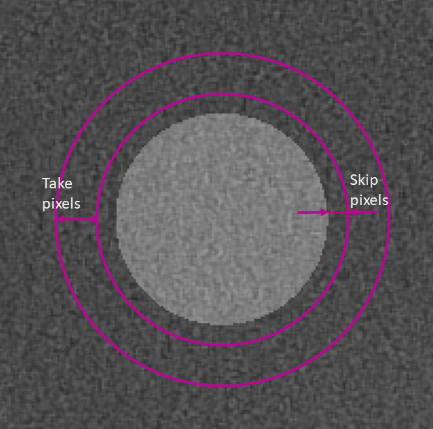 
Net signal parameters explanation

When one of the three versions of "Net signal" is selected, the "Scaled" option can also be chosen, which extends the pixel values to the entire display range and increases the contrast in the image. However, it's important to note that using this option will alter both the absolute and relative relationships between individual pixel values. It is recommended to use this mainly for visual purposes.

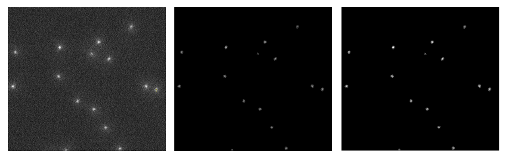 
Net signal parameters explanation

- **Background** - available background display options:
  - **White** - background displayed in white;
  - **Black** - background displayed in black;
  - **Orginal** - the background displayed is the same as in the original image;
  - **Degree of matching** - pixel brightness corresponds to the difference between the "point brightness" calculated by the program and the "background brightness".

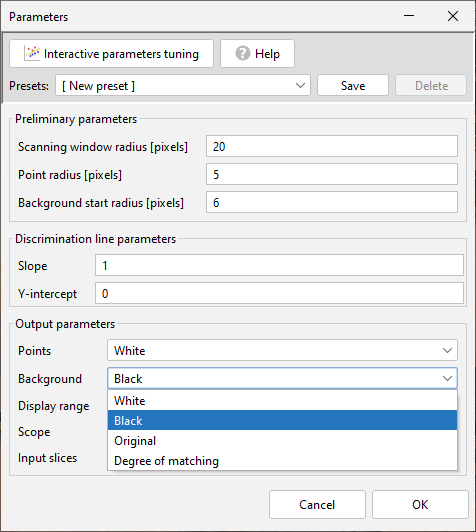

Additional options:
- **Scope**: choose whether the plugin should perform operations solely on the selected image (**Current slice**) or on all images in the stack in the active window (**All slices**).
- **Input slices**: this feature provides the option to select between a stack of processed images (**Omit**) or a stack where the resulting images are interleaved with the corresponding original images (**Include**). It is beneficial, for instance, when comparing resulting and original images or when creating masks.
- **Display range**: for the selected image (or stack), the display range can either remain unchanged (**Keep**) or be reset so that a pixel value of 0 corresponds to black (**Reset** ). This transformation will change the absolute pixel values ​​but retain their relative values. For example, if the basic display range is 1746.0 - 15951.0, where 1746.0 corresponds to the darkest pixel in the image (black), and 15951.0 corresponds to the brightest pixel (white), then after the transformation, the pixels will take values ​​in the range 0 - 14205.0. The value of each pixel in each of the images in the stack has been reduced by 1746.0, and now black pixels have a value of 0, while white pixels have a value of 14205.0.

## Manual mode
In manual mode, you can optimize input parameters and, most importantly, the discrimination line parameters. Working in manual mode is done on the currently active image (or active image in a stack). To switch to manual mode, click the "**Interactive parameters tuning**" button located in the upper right corner of the window.

After pressing this button, the program automatically goes to the manual mode menu and opens two additional windows: **Preview** and **Plot**.

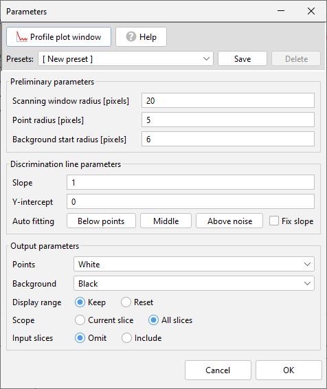

In the manual mode window, you will notice that the "**Interactive parameters tuning**" button has been replaced by the "**Profile plot window**" button, which opens an additional window displaying profiles for individual points. Furthermore, in the **Discrimination line parameters** section, there are additional options related to curve fitting (**Auto fitting**).

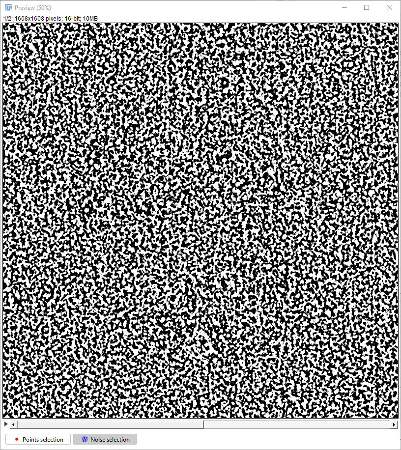

The **Preview** window is a stack of two images. The first image shows a preview of the predicted result, while the second image is the original input image. This allows for a real-time comparison between the input and output images. 

The **Plot** window initially contains only a chart template used to establish the discrimination line parameters.

### Algorithm for setting line and preliminary parameters

1. Determining the initial parameters
2. Marking background areas
3. Marking of signal points
4. Establishing discrimination line parameters
5. Determining the output parameters

#### Determining the initial parameters

In the main "**Parameters**" window, input the initial conditions under "**Preliminary parameters**":

- "**Scanning window radius**" refers to the size of the scanning window in pixels (half the length of the side of the square). The window should ideally be sized so that there is at most one signal element in the scanning window each time, with a comparable amount of background surrounding it. It's important to note that the smaller the scanning window, the shorter the plugin's operating time will be.
- **Point radius** - point size in pixels (radius). For objects with symmetrical dimensions, please enter their radius in pixels. If the objects are of different sizes, enter the value for the smallest one. If the horizontal and vertical dimensions of the objects you are looking for are significantly different, please provide the value of the smaller dimension. The specified radius must be smaller than the **Scanning window radius**.
- **Background start radius** - distance from the analyzed point, above which pixels located are treated as background. This distance should be greater than **Point radius** and smaller than the **Scanning window radius**.

#### Marking background areas

Select the areas in the image that you consider to be the background. Make sure not to include the part related to the signal. It's best to choose areas with the most varied intensities and those close to the signal we want to isolate.

The default selection tool in ImageJ for choosing background areas is the oval. You have the option to switch this tool to any other selection tools in ImageJ (Rectangle, Polygon selections, Freehand selections). It is possible to use different tools on different areas of the image. When you need to select more than one area, simply use the SHIFT key. You can move the previously selected area using the mouse. To delete selected background areas, use the right ALT key. Additionally, you can access the tools from **Edit -> Selection**.

In the Preview window, you can select the background both in the original image and in the preview image.

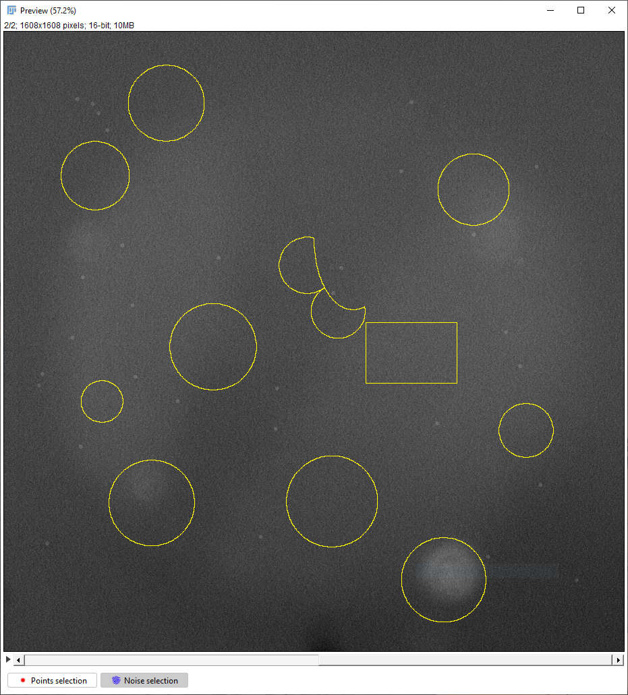

Sample image with the selected background

The selected background points will appear on the plot as blue circles.

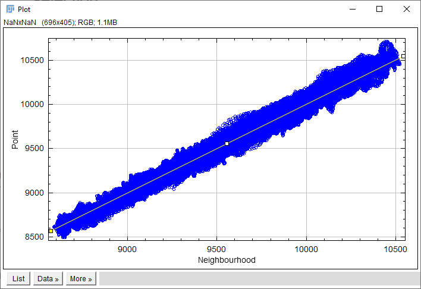

Background points plotted on the graph (blue points)

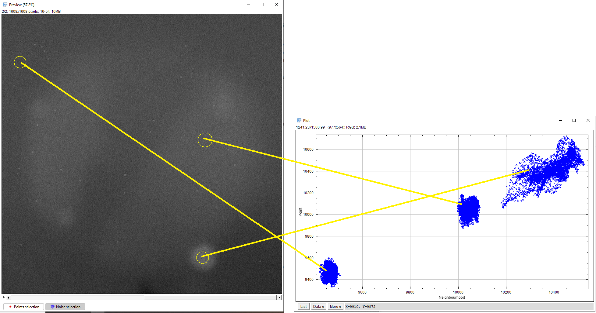

Background points selected in the image transferred to the chart.

#### Marking of signal points

To switch from the background selection mode to the point selection mode, click on the **Points selection** button in the **Preview** window. When you do this, the selected background areas will disappear. If you want to go back to the background selection mode, simply click on the **Background selection** button. 

Points can be selected using the ImageJ **Multi-point** tool. After marking the points, you can move them using the mouse. To delete a selected point, click on it while pressing the left or right ALT key. Just like selecting the background, points can be selected in both the original image and in the preview.

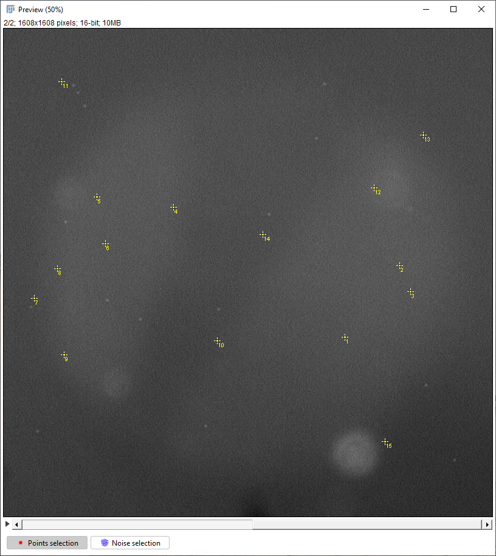

Sample image with the selected signal points

The graph will display yellow circles corresponding to the points selected in the image. The numbers on the image will match with the numbers on the chart, allowing you to make adjustments if needed.

Signal points plotted on the graph (yellow points)

In order to accurately define the boundary of objects, it is recommended to mark points near the edge of the object.

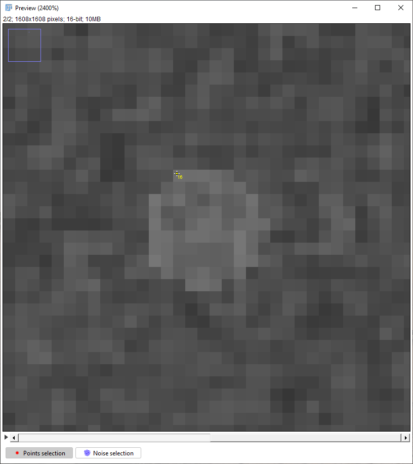

Example of marking a point on the boundary of an object.

#### Establishing discrimination line parameters

After selecting both the background and the signal in the **Preview** window, you will be able to view the corresponding points on the graph. These points can be used to draw a discrimination line, which is represented by a yellow line on the chart. You can adjust the position of this line by dragging it with the mouse or by changing its slope with the mouse. Alternatively, you can enter specific numerical values for the line's parameters in the **Parameters** window. The equation of a straight line is:

$$
  y = a*x+b
$$

- **Slope** - slope coefficient of simple discrimination (a);
- **Y-Intercept** - the point of intersection of the discrimination line with the OY axis (b).

The second method is particularly useful when we require a specific slope for the adjusted straight line.

The third option is to use one of the three buttons in the **Preview** window in the **Discrimination line** section:
- **Below points** - the line is fitted so that it is just below the lowest signal points marked on the chart;
- **Middle** - the line is adjusted in the middle of the distance between the highest marked points of the background and the lowest marked points of the signal;
-**Above noise** -  the line is fitted just above the highest selected noise points.

The slope of the straight line can be fixed by checking the **Fix slope** checkbox.

To enable automatic adjustment of discrimination line parameters, a minimum of 5 signal points and 10 noise points must be marked on the graph. Additionally, the signal and noise points should be in similar **Neighborhood**. If the discrimination line cannot be automatically adjusted, the plugin will display an appropriate message.

Discrimination line fitted using **Below points** button

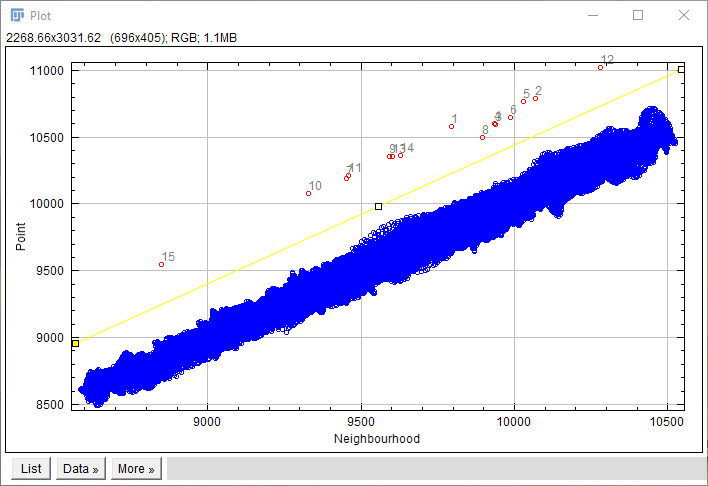

Discrimination line fitted using **Middle** button

Discrimination line fitted using **Above noise** button

#### Determining the output parameters

The last stage is to determine the output parameters. In particular, how signal points and background are displayed in the output image. Below are examples of different options for displaying the same resulting image. Particular attention should be paid to the fact that not all methods allow maintaining the nominal signal intensity.

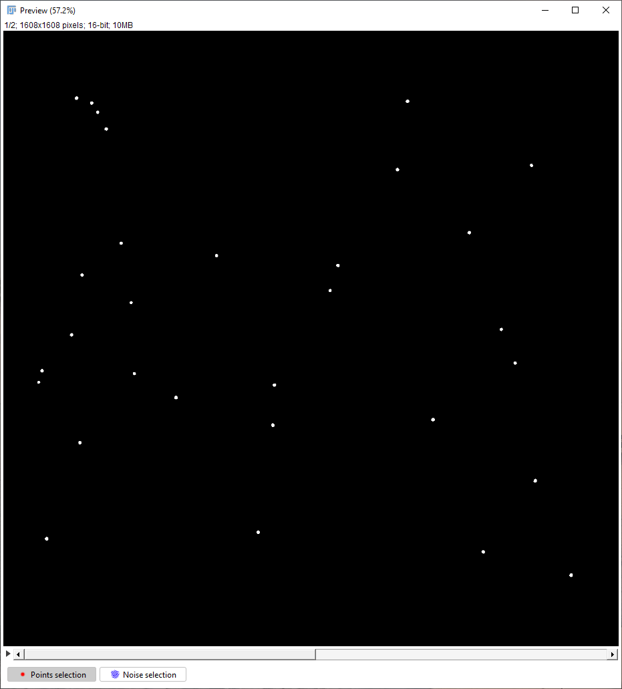

White points on black background preview

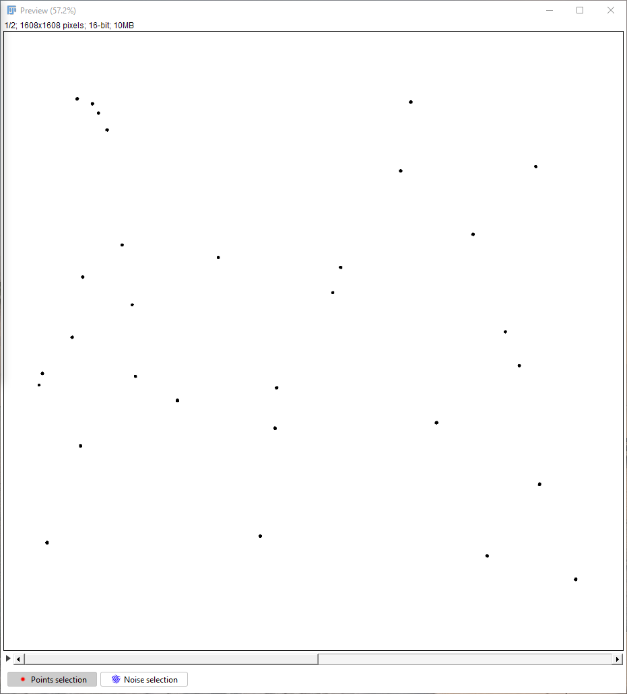

Black points on white background preview

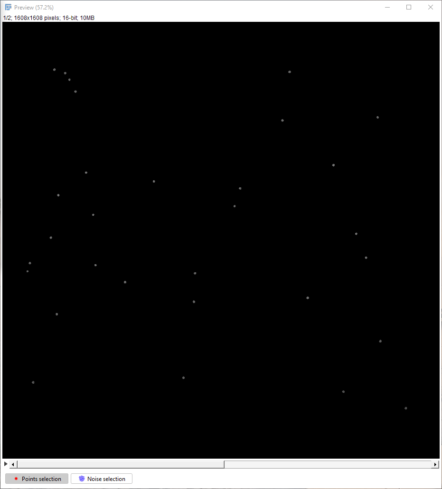

The original intensity of signal points on the black background preview

Intensity of points showing the degree of matching of signal points on black background preview

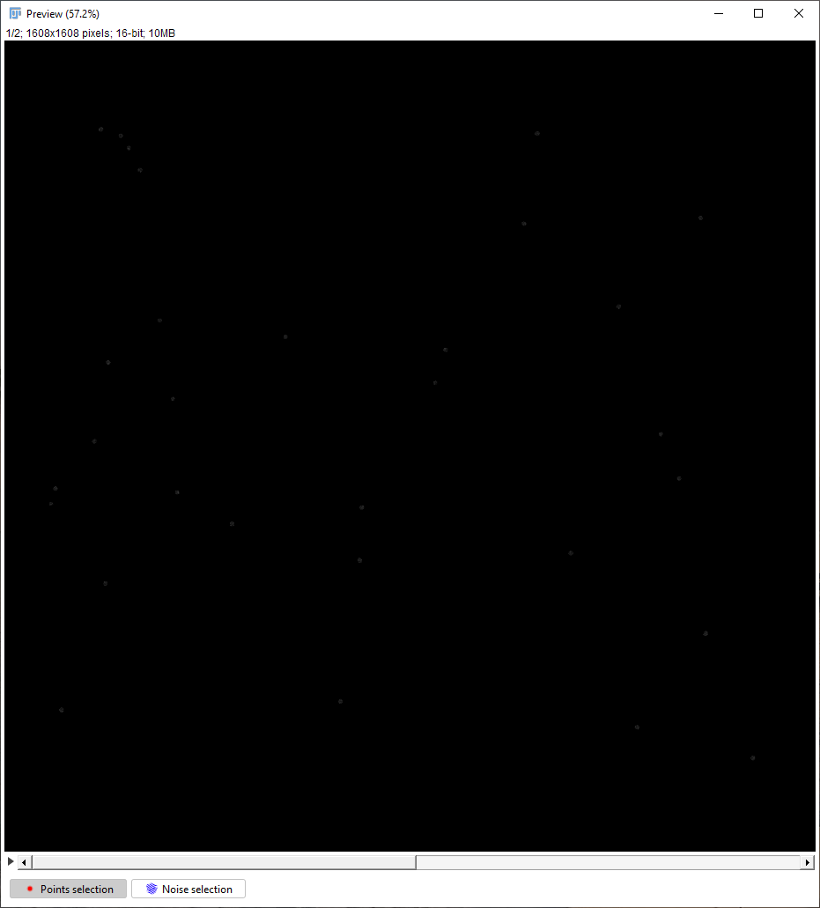 
Net signal of points (using median) on black background preview

### Profile plot window

In manual mode, you can view histograms created for individual signals and background points marked on the graph. To do this, click the "Profile plot window" button in the upper left corner of the "Parameters" window. A new "Profiles" window will open. The graph displays the profiles of selected signal points in red (maximum 10) and the background profiles in blue (maximum 10 points). The light blue vertical line indicates the point from which the pixel's surroundings are counted. The maximum value on the X-axis corresponds to the size of the scanning window.

Detailed information on how these profiles are calculated can be found in the publication.

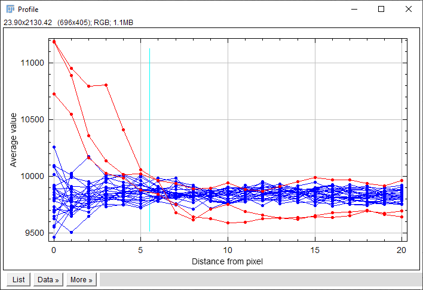

Example of profile window
