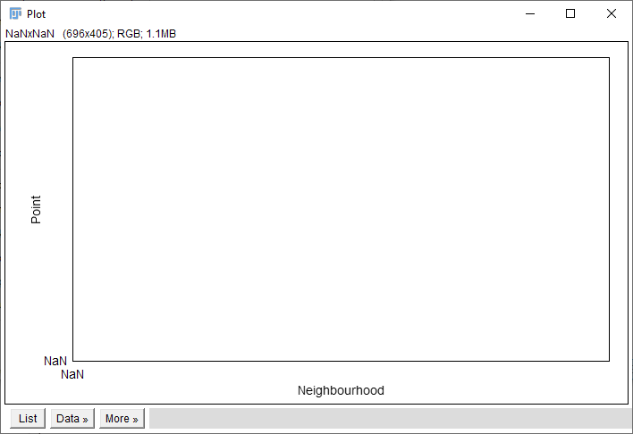

# Background Remover Help

## Installation and introductory information

In order to use the microscope image processing toolkit for separating signal from noise, you will need to download the BackgroundRemover.jar file and place it in the Plugins directory, which is a subdirectory of either the ImageJ or Figi.app directory. After restarting the program, the toolkit will be readily accessible in the drop-down menu under ImageJ: **Plugins -> Background Remover**.

The file should be imported as a single image or a stack. The image (or stack) must be in a 16-bit grayscale. By default, the plugin is run for the active window.

The program has two modes: automatic and manual. In automatic mode, we can enter predetermined parameters in individual fields or load a previously saved set of parameters (Preset). After clicking OK, the program automatically searches for points and opens a new window with the resulting image. We switch to manual mode using the "**Interactive parameters tuning**" button located in the upper left part of the window.

The plugin places annotations regarding the operations performed on the file. They can be viewed by going to **Image -> Show Info...**.

Please note that due to the specific nature of ImageJ, annotations are displayed in random order. They should be read in the order consistent with the numbering given in square brackets.

## Automatic mode

The automatic mode is easy to use and performs transformations based on user-provided parameters. These parameters can be entered manually or loaded from a file.

### Presets

The new preset can be created by selecting the **[ New ]** option from the **Presets** drop-down list. After all the fields with the set parameters have been completed, the **Save** button should be clicked. A new window will open, asking for the name of the preset being saved. Once a name is selected and confirmed, the created preset will appear in the preset drop-down list at the top of the window.

To access a previously created preset, it can be selected from the **Presets** drop-down list. The existing preset can be updated while maintaining the changes made using the **Save** button. By selecting **[Recently used]** from the drop-down list, the most recently used preset will be loaded. The preset can be deleted using the **Delete** button.

### Preliminary parameters

Preliminary parameters determine the size of the scanning window and the approximate size of objects in the image.

- **Scanning window radius** - the size of the scanning window in pixels (half the length of the side of the square);
- **Point radius** - point size in pixels (radius);
- **Background start radius** - distance from the analyzed point, above which pixels located are treated as background (this distance should be greater than **Point radius**).

### Discrimination line parameters

To separate the signal from the noise, the program uses an appropriately adjusted discrimination line with the equation:

$$
  y = a*x+b
$$

- **Slope** - slope coefficient of simple discrimination (a);
- **Y-Intercept** - the point of intersection of the discrimination line with the OY axis (b).

Jeżeli parametry te nie są znane, należy je ustalić w trybie manualnym.

### Output parameters

If these parameters are not known, they should be set in manual mode.

**Points** - point display options available in the drop-down list:
  - **White** - points displayed in white;
  - **Black** - points displayed in black;
  - **Orginal** - points displayed the same as in the original image;
  - **Degree of matching** - pixel brightness corresponds to the difference between the "point brightness" calculated by the program and the "background brightness" (the brighter the point, the more it "sticks out above the background");
  - **Net signal (average)** - the pixel value corresponds to the basic pixel value minus the background calculated as the arithmetic mean of pixels around a given point;
  - **Net signal (mode)** - the pixel value corresponds to the basic pixel value minus the background calculated as the modal value of pixels around a given point;
  - **Net signal (median)** - the pixel value corresponds to the basic pixel value minus the background calculated as the median of pixels around a given point.

If one of the **Net signal** options is selected, two additional fields will appear with parameters to set:
- **Skip pixels** - the difference between the radius of the point for which the background is calculated and the inner radius of the ring based on which the background value is calculated.
- **Take pixels** - the difference between the outer and inner radius of the ring used to calculate the background.

When one of the three versions of "Net signal" is selected, the "Scaled" option can also be chosen, which extends the pixel values to the entire display range and increases the contrast in the image. However, it's important to note that using this option will alter both the absolute and relative relationships between individual pixel values. It is recommended to use this mainly for visual purposes.

- **Background** - available background display options:
  - **White** - background displayed in white;
  - **Black** - background displayed in black;
  - **Orginal** - the background displayed is the same as in the original image;
  - **Degree of matching** - pixel brightness corresponds to the difference between the "point brightness" calculated by the program and the "background brightness".

Additional options:
- **Scope**: choose whether the plugin should perform operations solely on the selected image (**Current slice**) or on all images in the stack in the active window (**All slices**).
- **Input slices**: this feature provides the option to select between a stack of processed images (**Omit**) or a stack where the resulting images are interleaved with the corresponding original images (**Include**). It is beneficial, for instance, when comparing resulting and original images or when creating masks.
- **Display range**: for the selected image (or stack), the display range can either remain unchanged (**Keep**) or be reset so that a pixel value of 0 corresponds to black (**Reset** ). This transformation will change the absolute pixel values ​​but retain their relative values. For example, if the basic display range is 1746.0 - 15951.0, where 1746.0 corresponds to the darkest pixel in the image (black), and 15951.0 corresponds to the brightest pixel (white), then after the transformation, the pixels will take values ​​in the range 0 - 14205.0. The value of each pixel in each of the images in the stack has been reduced by 1746.0, and now black pixels have a value of 0, while white pixels have a value of 14205.0.

## Manual mode

Tryb manualny pozwala na optymalizację parametrów wejściowych oraz przede wszystkim parametrów discrimination line. Praca w trybie manualnym odbywa się na aktualnie aktywnytm obrazie (lub obrazie w stacku). Aby przejść do trybu manualnego należy wcisnąć przycisk "**Interactive parameters tuning**" zlokalizowany w górnym prawym rogu okna.

Po wciśnięciu tego prezycisku program automatycznie przechodzi do menu trybu manualnego oraz otwiera dwa dodatkowe okna: **Preview** oraz **Plot**.

